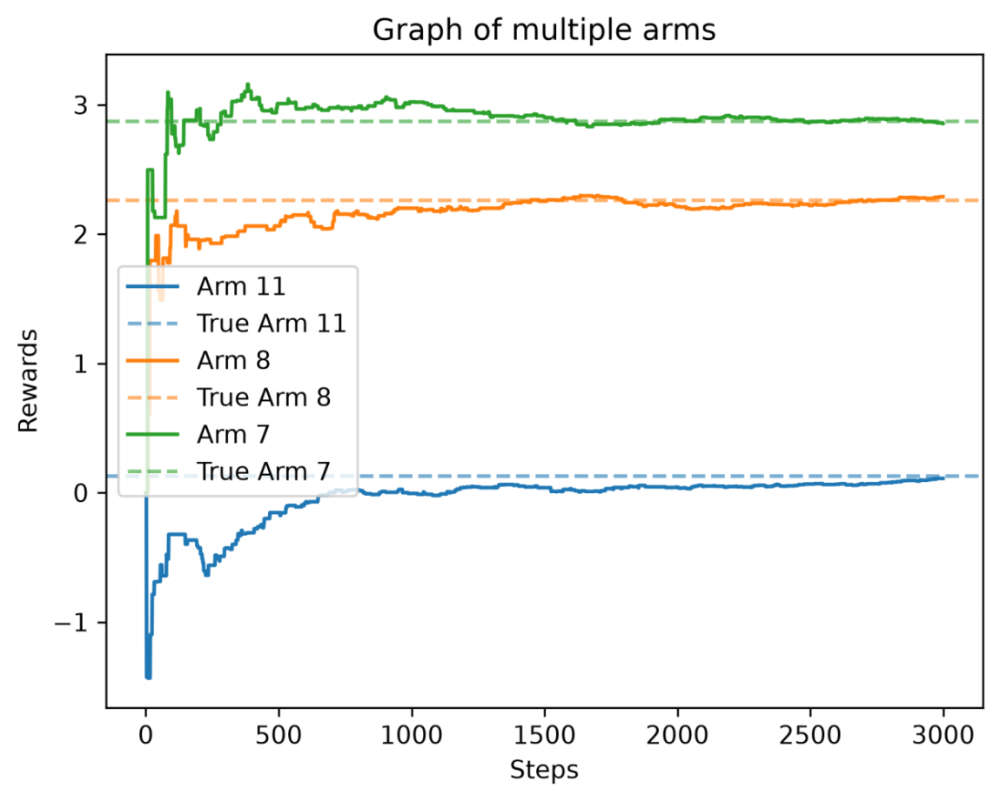

# k-Arm-Bandit-v2

A modular Python framework for simulating, benchmarking, and visualizing Multi-Armed Bandit strategies.

## Features

- Epsilon Greedy
- UCB
- Stationary environments
- Non-stationary environments
- Regret tracking
- CSV experiment logging
- Plotting utilities

## Installation

pip install -r requirements.txt

## Examples

python -m examples.epsilon_greedy
python -m examples.ucb
python -m examples.non_stationary

## Usage

python -m src.main

## Implemented Strategies

| Strategy               | Description                                   |
| ---------------------- | --------------------------------------------- |
| Exploration            | Arm is selected randomly                      |
| Exploitation           | The arm with the best known value is selected |
| Epsilon Greedy         | Explores with (ε) and Exploits with (1-ε)     |
| Upper Confidence Bound | Balances estimates and uncertainty            |

## Example Results

## Project Structure

src/ core framework  
examples/ ready-to-run demos  
results/ logs and output plots  
tests/ unit tests

## Future Work

- Thompson Sampling
- Softmax Exploration

## Quick tips

#### Refer to examples

#### To view the graphs set plot=True
